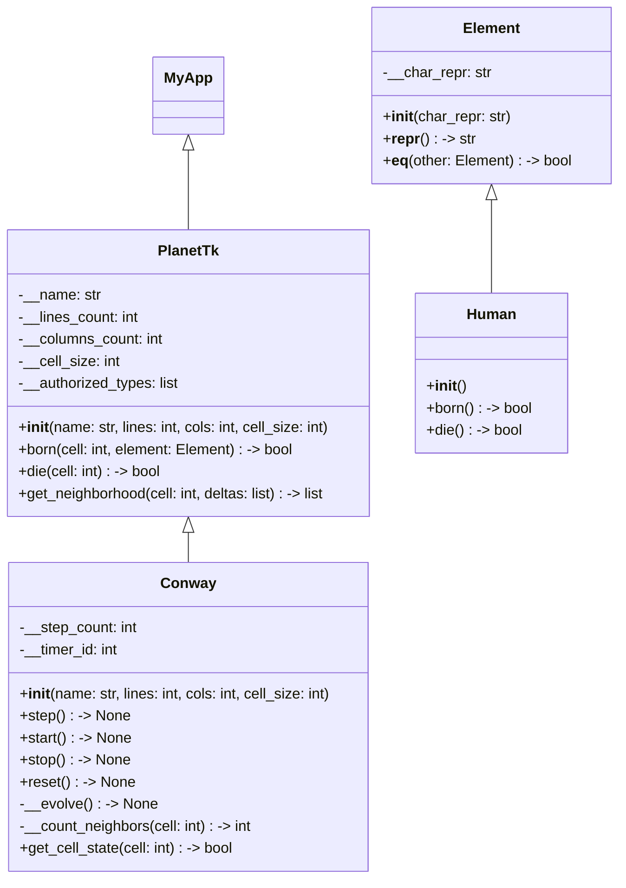

# Diagramme de Classes - Jeu de Conway

```mermaid
classDiagram

class PlanetTk {
    -__name: str
    -__lines_count: int
    -__columns_count: int
    -__cell_size: int
    -__authorized_types: list
    +__init__(name: str, lines: int, cols: int, cell_size: int)
    +born(cell: int, element: Element) -> bool
    +die(cell: int) -> bool
    +get_neighborhood(cell: int, deltas: list) -> list
}

class Element {
    -__char_repr: str
    +__init__(char_repr: str)
    +__repr__() -> str
    +__eq__(other: Element) -> bool
}

class Human {
    +__init__()
    +born() -> bool
    +die() -> bool
}

class Conway {
    -__step_count: int
    -__timer_id: int
    +__init__(name: str, lines: int, cols: int, cell_size: int)
    +step() -> None
    +start() -> None
    +stop() -> None
    +reset() -> None
    -__evolve() -> None
    -__count_neighbors(cell: int) -> int
    +get_cell_state(cell: int) -> bool
}

MyApp <|-- PlanetTk
PlanetTk <|-- Conway
Element <|-- Human
```
